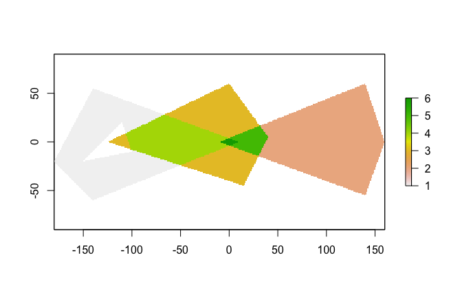

fasterize
=========

Fast sf-to-raster conversion

[](http://www.repostatus.org/#active) [](https://badges.mit-license.org/) [](https://travis-ci.org/ecohealthalliance/fasterize) [](https://ci.appveyor.com/project/NoamRoss/fasterize-7kxl2) [](https://codecov.io/gh/ecohealthalliance/fasterize) [](http://www.r-pkg.org/pkg/fasterize) [](http://www.r-pkg.org/pkg/fasterize)

**fasterize** is a high-performance replacement for the `rasterize()` function in the [**raster**](https://cran.r-project.org/package=raster) package.

Functionality is currently limited to rasterizing polygons in [**sf**](https://cran.r-project.org/package=sf)-type data frames.

Installation
------------

Install the current version of **fasterize** from CRAN:

``` r
install.packages('fasterize')
```

Install the development version of **fasterize** with [**devtools**](https://cran.r-project.org/package=devtools):

``` r
devtools::install_github("ecohealthalliance/fasterize")
```

**fasterize** uses [**Rcpp**](https://cran.r-project.org/package=Rcpp) and thus requires a compile toolchain to install from source. Testing (and most use) requires [**sf**](https://cran.r-project.org/package=sf), which requires GDAL (&gt;= 2.0.0), GEOS (&gt;= 3.3.0), and PROJ.4 (&gt;= 4.8.0) to be installed on your system.

Usage
-----

The main function, `fasterize()`, takes the same inputs as `raster::rasterize()` but currently has fewer options and is is limited to rasterizing polygons.

A method for creating empty rasters from `sf` objects is provided, and raster plot methods are re-exported.

``` r
library(raster)
library(fasterize)
library(sf)
p1 <- rbind(c(-180,-20), c(-140,55), c(10, 0), c(-140,-60), c(-180,-20))
hole <- rbind(c(-150,-20), c(-100,-10), c(-110,20), c(-150,-20))
p1 <- list(p1, hole)
p2 <- list(rbind(c(-10,0), c(140,60), c(160,0), c(140,-55), c(-10,0)))
p3 <- list(rbind(c(-125,0), c(0,60), c(40,5), c(15,-45), c(-125,0)))
pols <- st_sf(value = c(1,2,3),
             geometry = st_sfc(lapply(list(p1, p2, p3), st_polygon)))
r <- raster(pols, res = 1)
r <- fasterize(pols, r, field = "value", fun="sum")
plot(r)
```



Performance
-----------

Let's compare `fasterize()` to `raster::rasterize()`:

``` r
pols_r <- as(pols, "Spatial")
bench <- microbenchmark::microbenchmark(
  rasterize = r <- raster::rasterize(pols_r, r, field = "value", fun="sum"),
  fasterize = f <- fasterize(pols, r, field = "value", fun="sum"),
  unit = "ms"
)
print(bench, digits = 3)
```

    #> Unit: milliseconds
    #>       expr     min      lq    mean  median      uq    max neval cld
    #>  rasterize 342.486 379.028 426.959 404.759 434.029 859.01   100   b
    #>  fasterize   0.337   0.368   0.499   0.413   0.636   2.02   100  a

How does `fasterize()` do on a large set of polygons? Here I download the IUCN shapefile for the ranges of all terrestrial mammals and generate a 1/6 degree world map of mammalian biodiversity by rasterizing all the layers.

``` r
if(!dir.exists("Mammals_Terrestrial")) {
  download.file(
    "https://s3.amazonaws.com/hp3-shapefiles/Mammals_Terrestrial.zip",
    destfile = "Mammals_Terrestrial.zip") # <-- 383 MB
  unzip("Mammals_Terrestrial.zip", exdir = ".")
  unlink("Mammals_Terrestrial.zip")
}
```

``` r
mammal_shapes <- st_read("Mammals_Terrestrial")
```

    #> Reading layer `Mammals_Terrestrial' from data source `/Users/noamross/dropbox-eha/projects-eha/fasterize/Mammals_Terrestrial' using driver `ESRI Shapefile'
    #> Simple feature collection with 42714 features and 27 fields
    #> geometry type:  MULTIPOLYGON
    #> dimension:      XY
    #> bbox:           xmin: -180 ymin: -85.58276 xmax: 180 ymax: 89.99999
    #> epsg (SRID):    4326
    #> proj4string:    +proj=longlat +datum=WGS84 +no_defs

``` r
mammal_raster <- raster(mammal_shapes, res = 1/6)
bench2 <- microbenchmark::microbenchmark(
  mammals = mammal_raster <- fasterize(mammal_shapes, mammal_raster, fun="sum"),
  times=20, unit = "s")
print(bench2, digits=3)
```

    #> Unit: seconds
    #>     expr   min    lq  mean median    uq   max neval
    #>  mammals 0.847 0.857 0.883  0.886 0.894 0.963    20

``` r
par(mar=c(0,0.5,0,0.5))
plot(mammal_raster, axes=FALSE, box=FALSE)
```


About
-----

**fasterize** is developed openly at [EcoHealth Alliance](https://github.com/ecohealthalliance) under the USAID PREDICT project. Please note that this project is released with a [Contributor Code of Conduct](CODE_OF_CONDUCT.md). By participating in this project you agree to abide by its terms.

[](http://www.ecohealthalliance.org/) [](http://www.vetmed.ucdavis.edu/ohi/predict/)
