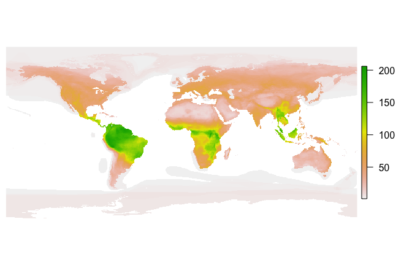

fasterize
=========

Fast sf-to-raster conversion

[](http://www.repostatus.org/#wip) [](https://badges.mit-license.org/) [](https://travis-ci.org/ecohealthalliance/fasterize) [](https://ci.appveyor.com/project/NoamRoss/fasterize-7kxl2) [](https://codecov.io/github/ecohealthalliance/fasterize?branch=master) [](http://www.r-pkg.org/pkg/fasterize) <!-- [](http://www.r-pkg.org/pkg/fasterize)  -->

**fasterize** is high-performance replacement for the `rasterize()` function in the [**raster**]() package.

Functionality is currently limited to rasterizing polygons in [**sf**](https::/cran.r-project.org/pakcage=sf)-type data frames.

Installation
------------

Install **fasterize** with [**devtools**](https::/cran.r-project.org/pakcage=Rcpp). **fasterize** uses [**Rcpp**](https::/cran.r-project.org/pakcage=Rcpp) and thus requires a compile toolchain to install. It also requires [**sf**](https::/cran.r-project.org/pakcage=sf), which requires GDAL (&gt;= 2.0.0), GEOS (&gt;= 3.3.0), PROJ.4 (&gt;= 4.8.0).

``` r
devtools::install_github("ecohealthalliance/fasterize")
```

Usage
-----

The main function, `fasterize()`, takes the same inputs as `raster::rasterize()` but currently has fewer options and is currently limited to rasterizing polygons.

A method for creating empty rasters from `sf` objects is provided, and raster plot methods are re-exported.

``` r
library(raster)
library(fasterize)
library(sf)
p1 <- rbind(c(-180,-20), c(-140,55), c(10, 0), c(-140,-60), c(-180,-20))
hole <- rbind(c(-150,-20), c(-100,-10), c(-110,20), c(-150,-20))
p1 <- list(p1, hole)
p2 <- list(rbind(c(-10,0), c(140,60), c(160,0), c(140,-55), c(-10,0)))
p3 <- list(rbind(c(-125,0), c(0,60), c(40,5), c(15,-45), c(-125,0)))
pols <- st_sf(value = c(1,2,3),
             geometry = st_sfc(lapply(list(p1, p2, p3), st_polygon)))
r <- raster(pols, res = 1)
r <- fasterize(pols, r, field = "value", fun="sum")
plot(r)
```


Performance
-----------

Let's compare `fasterize()` to `raster::rasterize()`:

``` r
pols_r <- as(pols, "Spatial")
bench <- microbenchmark::microbenchmark(
  rasterize = r <- raster::rasterize(pols_r, r, field = "value", fun="sum"),
  fasterize = f <- fasterize(pols, r, field = "value", fun="sum"),
  unit = "ms"
)
print(bench, digits = 3)
```

    #> Unit: milliseconds
    #>       expr     min    lq    mean median      uq     max neval cld
    #>  rasterize 349.810 433.5 626.083 490.92 704.756 2342.53   100   b
    #>  fasterize   0.281   0.3   0.545   0.34   0.475    2.95   100  a

How does `fasterize()` do on a large set of polygons? Here I download the IUCN shapefile for the ranges of all terrestrial mammals and generate a 1/6 degree world map of mammalian biodiversity by rasterizing all the layers.

``` r
download.file(
  "http://spatial-data.s3.amazonaws.com/groups/TERRESTRIAL_MAMMALS.zip",
  destfile = "Mammals_Terrestrial.zip") # <-- 383 MB
unzip("Mammals_Terrestrial.zip", exdir = "Mammals_Terrestrial")
```

``` r
mammal_shapes <- st_read("Mammals_Terrestrial")
```

    #> Reading layer `Mammals_Terrestrial' from data source `/Users/noamross/Dropbox (EHA)/projects/fasterize/Mammals_Terrestrial' using driver `ESRI Shapefile'
    #> converted into: MULTIPOLYGON
    #> Simple feature collection with 42714 features and 27 fields
    #> geometry type:  MULTIPOLYGON
    #> dimension:      XY
    #> bbox:           xmin: -180 ymin: -85.58276 xmax: 180 ymax: 89.99999
    #> epsg (SRID):    4326
    #> proj4string:    +proj=longlat +datum=WGS84 +no_defs

``` r
mammal_raster <- raster(mammal_shapes, res = 1/6)
bench2 <- microbenchmark::microbenchmark(
  mammals = mammal_raster <- fasterize(mammal_shapes, mammal_raster, fun="sum"),
  times=20, unit = "s")
print(bench2, digits=3)
```

    #> Unit: seconds
    #>     expr   min   lq mean median   uq  max neval
    #>  mammals 0.967 1.04 1.23   1.14 1.33 1.82    20

``` r
par(mar=c(0,0.5,0,0.5))
plot(mammal_raster, axes=FALSE, box=FALSE)
```



About
-----

**fasterize** is developed openly at [EcoHealth Alliance](https://github.com/ecohealthalliance). Please note that this project is released with a [Contributor Code of Conduct](CONDUCT.md). By participating in this project you agree to abide by its terms.

[](http://www.ecohealthalliance.org/)
